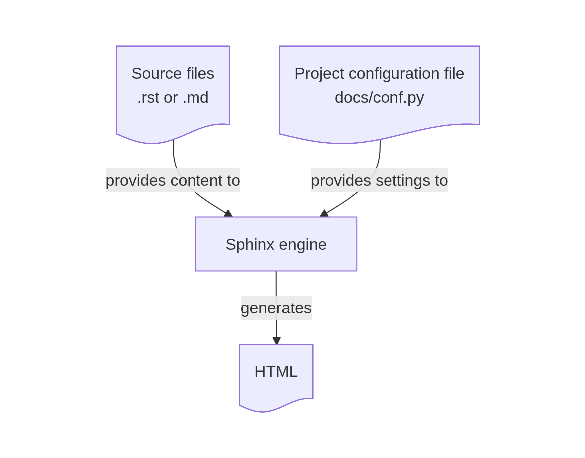
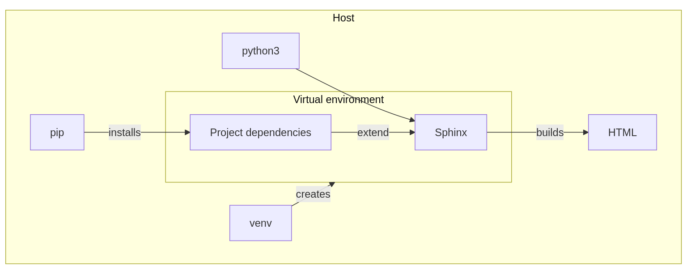
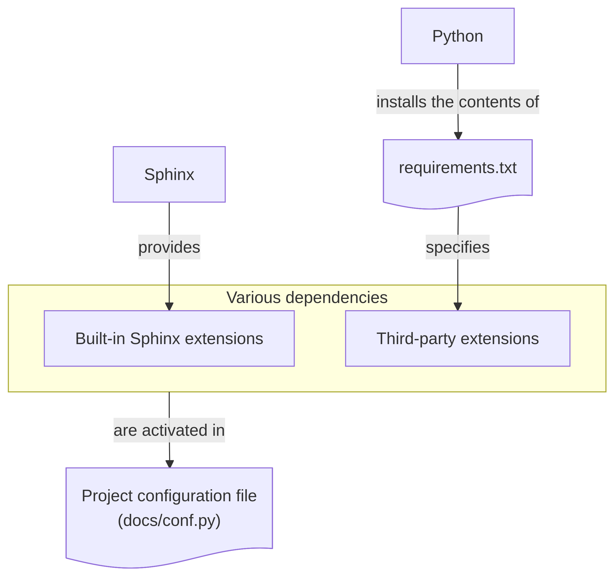
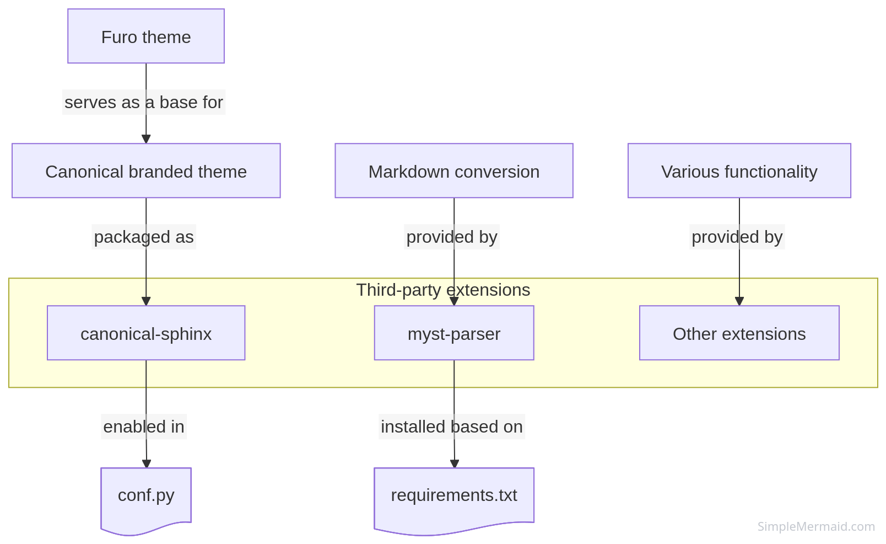
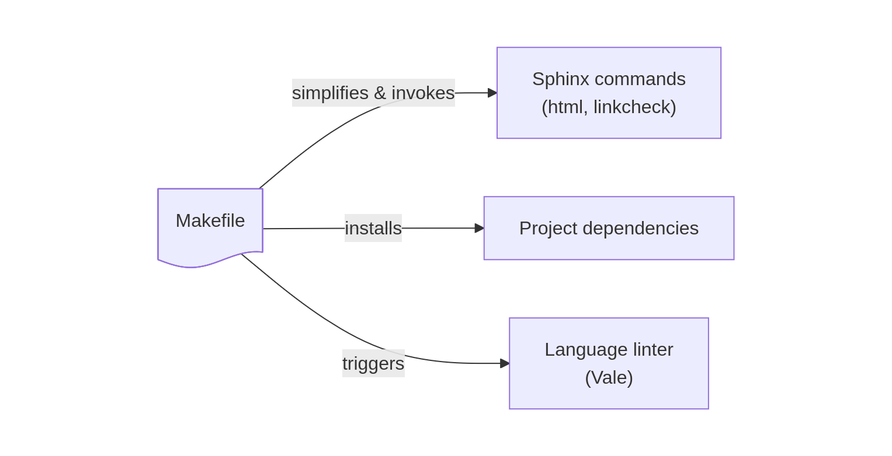
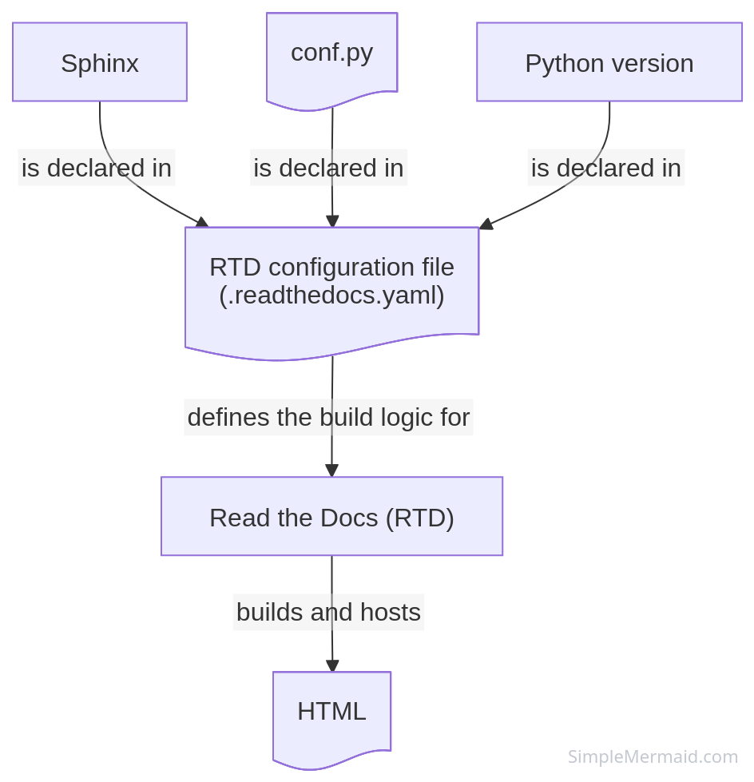

.. meta::
    :description: A breakdown of Canonical's Sphinx Starter Pack that covers its constituent elements and their purpose.

.. _explanation-components:

Starter pack components
=======================

The Starter Pack is a template `Sphinx <https://www.sphinx-doc.org/en/master/>`__ project. It provides the default layout for a new project's file structure, a theme, and all the necessary dependencies.

Sphinx
------

Sphinx is the core documentation static site generator that converts reStructuredText or Markdown files into HTML.

`docs/conf.py` is a configuration file that defines the properties of the Sphinx project such as project metadata and dependencies.
 

    Sphinx as a documentation static site generator
    
Python
------

Because Sphinx is a Python application, the Starter Pack depends on Python and a Python package manager. Most of its dependencies are Python packages. As it is generally recommended to work on projects locally in a virtual environment, the Starter Pack's local build relies on Python ``venv``. 

To be able to work on a Starter Pack project, your host needs Python 3.11, pip, and venv.

    Python's role in the Starter Pack

Extensions
----------

Sphinx's default functionality can be expanded with built-in or third-party extensions for tasks, such as creating diagrams, testing code, and more. 

The Starter Pack is preconfigured with a curated and tested set of extensions.

    Extension types
        
Built-in extensions
~~~~~~~~~~~~~~~~~~~

Built-in extensions do not need to be installed separately from Sphinx and can be enabled directly through `docs/conf.py`.
`docs/conf.py` in the Starter Pack has already been configured to enabled typical extensions necessary for documentation work.

Third-party extensions
~~~~~~~~~~~~~~~~~~~~~~

If an extension is not built into Sphinx, you must include it in `requirements.txt` before you can enable it in the Sphinx configuration file. 

As extensions are Python packages, the Starter Pack uses a `requirements.txt <https://pip.pypa.io/en/stable/reference/requirements-file-format/>`_ file to manage them.  

    Third-party extensions

Markdown support
^^^^^^^^^^^^^^^^

By default, Sphinx uses reStructuredText. To be able to build Markdown, it relies on the `MyST parser <https://myst-parser.readthedocs.io/en/latest/>`_, enabled by the `myst-parser` extension.

Canonical theme
^^^^^^^^^^^^^^^

The Canonical theme is packaged as a standalone `canonical-sphinx <https://github.com/canonical/canonical-sphinx>`_ extension. It is based on an upstream Furo theme and is designed to follow Canonical branding.

Command line tools
------------------

The Starter Pack uses Make as its local build system. The Starter Pack's Makefile serves as an interface for operating the project, including setting up the virtual environment, installing dependencies, and more, through CLI commands.

Makefile
~~~~~~~~

Some of the Makefile targets (such as ``html`` and ``linkcheck``) provide Sphinx-native functionality for building documentation or performing tests in a simplified form while managing required dependencies. For example, instead of using  the ``sphinx-build linkcheck SOURCEDIR OUTPUTDIR`` command, you can use ``make linkcheck``. 

See :ref:`explanation-build` to learn how the local build process works.  

Additionally, the Makefile provides commands to trigger third-party CLI tools, such as the Vale prose linter for :ref:`automatic-checks-styleguide`.

    Makefile build interface and its targets

Read The Docs configuration file
--------------------------------

Read The Docs is a documentation building and hosting platform. It takes the documentation created using Sphinx (or other tools) and builds and publishes it online.

If you are publishing your documentation through Read the Docs, the Read the Docs build logic is declared in ``.readthedocs.yaml``. The Starter Pack comes with a pre-configured  ``.readthedocs.yaml`` with default values that should work for the majority of projects.

See :ref:`rtd` to learn how configure your Read the Docs instance.  

    Read the Docs build configuration

