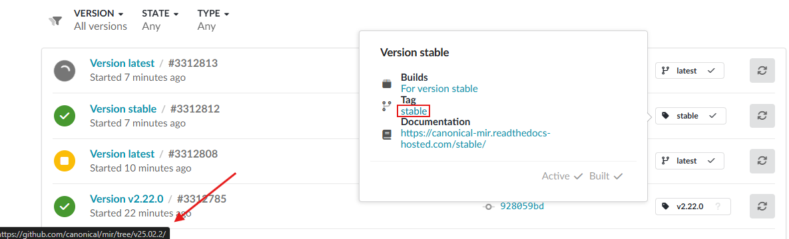

.. _how-to-troubleshoot-issues:

Troubleshoot issues
===================

This page provides guidance to resolve issues with the Starter Pack and ReadTheDocs
that are difficult to identify or that we don't expect to be solved.

Stable version won't build from the latest tag
----------------------------------------------

If your project has the ``stable`` version configured to build from tags, such as with
the default `semantic versioning behavior
<https://docs.readthedocs.com/platform/stable/versions.html#versions-are-git-tags-and-branches>`_,
your ``stable`` version can become out-of-step and continue building a particular tag,
even when the repository has newer tags.

Possible causes
~~~~~~~~~~~~~~~

An unwanted tag might have been pushed to the repository and then removed. Once
ReadTheDocs creates a version from a tag, it doesn't later verify that the tag still
exists, so the version will persist and become a zombie.

If the unwanted tag is a higher iterator than any existing tag, the zombie version will
always take precedence. For example, if tag ``20.2.0`` was pushed by accident and then
replaced with ``2.20.0``, the corresponding version 20.2.0 will persist, and ``stable``
will continue pointing to it.

Diagnosis
~~~~~~~~~

There's a roundabout procedure to verify whether your project is affected. Start by
opening your project dashboard on ReadTheDocs.

On the **Builds** tab, locate the most recent ``stable`` build. For that version, hover
over the status indicator. In the hover box, open the **stable** link. If the resulting
GitHub page is a 404, then your project has a zombie version.

Resolution
~~~~~~~~~~

On your project dashboard, open the **Versions** tab and click **Add version**.

Find the zombie version, deactivate it, then update it.

Rebuild ``stable`` by retriggering it on the dashboard or pushing a new tag to the
repository.

Issue tracking
~~~~~~~~~~~~~~

`readthedocs/readthedocs.org#12450
<https://github.com/readthedocs/readthedocs.org/issues/12450>`_
