.. meta::
    :description: The new features, changes, and fixes in Canonical's Sphinx Starter Pack 1.5.

.. _release-1.5:

Canonical's Sphinx Starter Pack 1.5
===================================

26 February 2026

These release notes cover new features and changes in Canonical's Sphinx Starter Pack
1.5. The `full commit log
<https://github.com/canonical/sphinx-docs-starter-pack/releases/tag/1.5>`__ is available
on GitHub.

Bring these changes into your docs:

- :ref:`Update starter pack 1.3.0 and higher <update-new-starter-pack>`
- :ref:`Update starter pack 1.2.0 and lower <update-legacy-starter-pack>`

What's new in 1.5
-----------------

New versioning
~~~~~~~~~~~~~~

We've revised our approach to versions. Because the starter pack is an evergreen
repository and not packaged software, it requires a different version process and
scheme.

Starting with 1.5, the starter pack only provides major and minor version numbers. Patch
numbers now correspond to the Git commits in the repository's ``main`` branch between
tagged releases.

Going forward, we'll continue to tag major and minor releases, and distribute hotfixes
to the tip of the repository's history. If untagged patch versions are too risky, or
your software policy requires that you lock to a specific version, we recommend you pin
to the latest minor version.

New upgrade guide
~~~~~~~~~~~~~~~~~

For docs based on starter pack 1.3 or higher, we published
:ref:`update-new-starter-pack`.

Contribution guide
~~~~~~~~~~~~~~~~~~

We've added a contribution guide for the project in ``CONTRIBUTING.md``. It's available
in upgraded repositories and `on GitHub
<https://github.com/canonical/sphinx-docs-starter-pack/blob/main/CONTRIBUTING.md>`__.

This guide is for developers of the starter pack. It's not meant for your project. After
updating, remove it from your project.

Quiet link check
~~~~~~~~~~~~~~~~

The link check by default was too verbose, logging every checked link.

The check now only logs on errors.

Environment variable updates
~~~~~~~~~~~~~~~~~~~~~~~~~~~~

For docs embedded into larger projects, the Make commands might be called in the
project's main build system. Because docs builds used common names like ``BUILDDIR``, it
was possible that they could conflict with variables set by the parent build system
meant for other software.

We made all the docs variables conditional, so you can set them ahead of time in the
parent build system.

To mediate the risk of conflicts, we overhauled the variable names, adding a prefix and
splitting along common word boundaries.

.. list-table::
    :header-rows: 1
    :widths: 1 3

    * - Old variable name
      - New variable name
    * - ``VENVDIR``
      - ``DOCS_VENVDIR``
    * - ``VENV``
      - ``DOCS_VENV``
    * - ``SOURCEDIR``
      - ``DOCS_SOURCEDIR``
    * - ``REQPDFPACKAGES``
      - ``DOCS_PDFPACKAGES``
    * - ``VOCAB_CANONICAL``
      - ``DOCS_VOCAB``
    * - ``SPHINXDIR``
      - ``SPHINX_DIR``
    * - ``SPHINXBUILD``
      - ``SPHINX_BUILD``
    * - ``VALEDIR``
      - ``VALE_DIR``
    * - ``VALECONFIG``
      - ``VALE_CONFIG``
    * - ``TARGET``
      - ``CHECK_PATH``

Dependency changes in 1.5
-------------------------

.. list-table::
    :header-rows: 1
    :widths: 2 1 1

    * - Package
      - From
      - To
    * - canonical-sphinx
      - >=0.5.1
      - ~=0.6
    * - sphinx-related-links
      - >=0.1.1
      - >=0.1.2

Removed in 1.5
--------------

``wokeignore`` directive
~~~~~~~~~~~~~~~~~~~~~~~~

The ``wokeignore`` directive is removed because it was redundant. Use the
:literalref:`vale-ignore <reference-automatic-checks-spelling-vale-ignore>` role
instead.

Contribution guide template
~~~~~~~~~~~~~~~~~~~~~~~~~~~

We removed a contribution guide template that was placed in the documentation in error.

Fixed in 1.5
------------

- `#472 <https://github.com/canonical/sphinx-docs-starter-pack/pull/472>`__ invalid
  characters in Makefile cause infinite loop
- `#477 <https://github.com/canonical/sphinx-docs-starter-pack/pull/477>`__ Version slug
  is duplicated in sitemaps
- `#501 <https://github.com/canonical/sphinx-docs-starter-pack/pull/501>`__
  Example-product docs are used in links but no longer available
- `#514 <https://github.com/canonical/sphinx-docs-starter-pack/pull/514>`__ Workflows
  can be called by other projects

Contributors
------------

We would like to express a big thank you to all the people who contributed to this release:

:literalref:`a-velasco <https://github.com/a-velasco>`,
:literalref:`akcano <https://github.com/akcano>`,
:literalref:`jahn-junior <https://github.com/jahn-junior>`,
:literalref:`medubelko <https://github.com/medubelko>`,
:literalref:`minaelee <https://github.com/minaelee>`,
:literalref:`nhennigan <https://github.com/nhennigan>`, and
:literalref:`odadacharles <https://github.com/odadacharles>`
