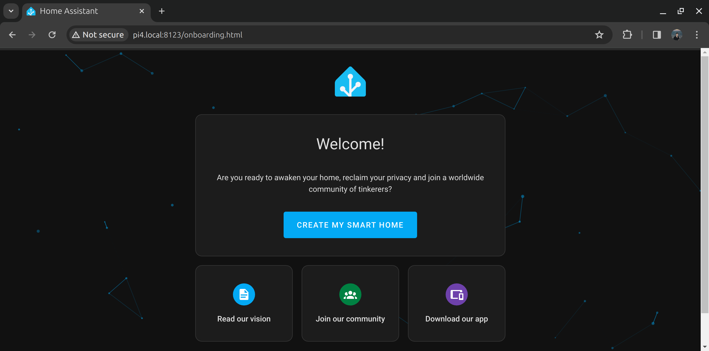
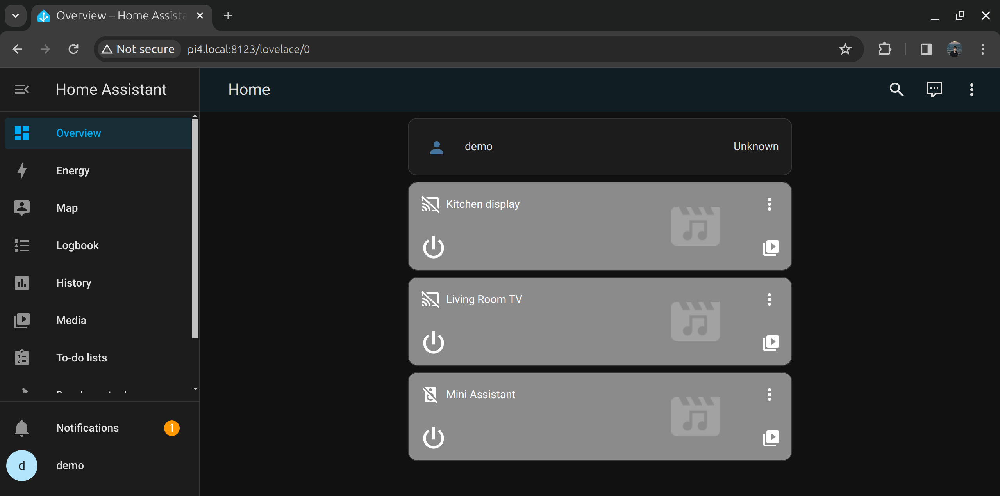
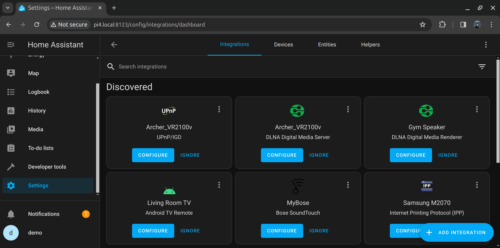
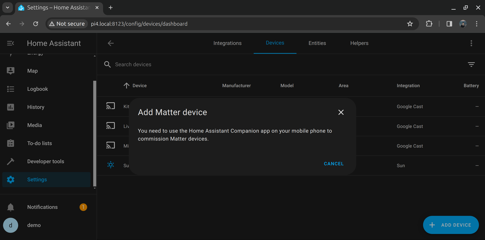
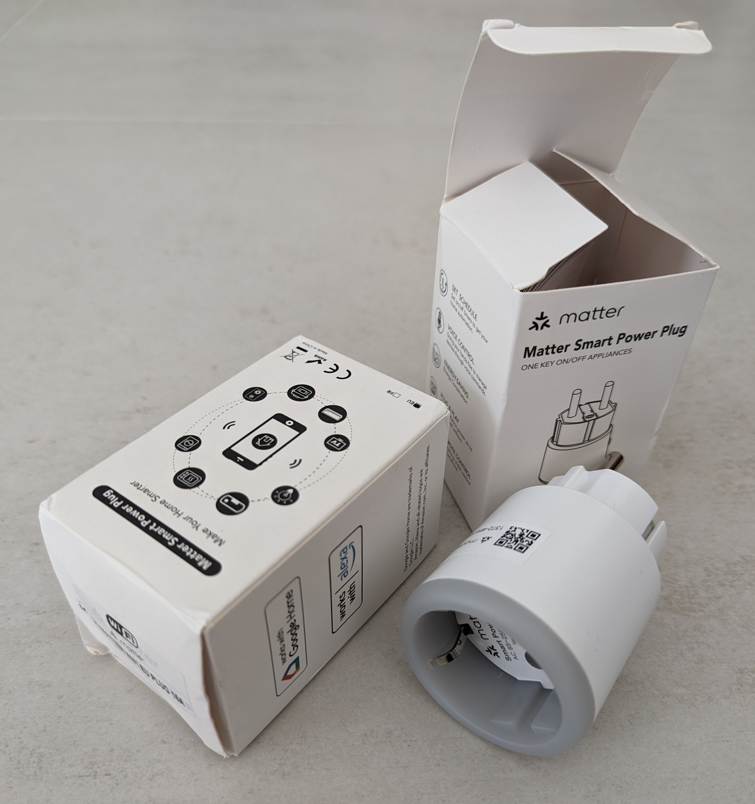
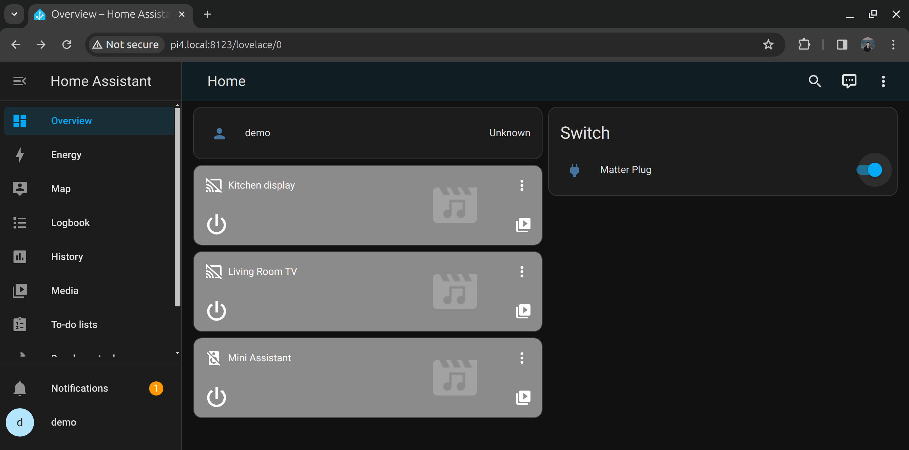

# How to install Home Assistant on Ubuntu Core

This guide walks you through installing Home Assistant (HASS) on Ubuntu Core.
Home Assistant is an open source home automation solution, designed with a
rich ecosystem of integrations for connecting smart devices.
We use Ubuntu Core as the OS, to guarantee a secure and up to date foundation
for what runs at the center of your smart home.

```{note}
The instructions should work on the following architectures:
- ARM64 / AArch64
- AMD64 / x86_64

The guide has been tested on Raspberry Pi 4.
```

## Install Ubuntu Core
Refer to the official documentation for [installing Ubuntu Core](https://ubuntu.com/core/docs/install-on-a-device).

## Set up the system
SSH to the machine. If you installed a pre-built Ubuntu Core image, it comes with Console Conf which has guided you to deploy the public keys from your Ubuntu SSO account. In this case, you should use your Ubuntu username to connect: `ssh <user>@<ip>`.

Take a look at what is installed:
```console
$ snap list
Name       Version         Rev    Tracking       Publisher   Notes
core22     20230703        821    latest/stable  canonical✓  base
pi         22-2            132    22/stable      canonical✓  gadget
pi-kernel  5.15.0-1048.51  778    22/stable      canonical✓  kernel
snapd      2.61.2          21185  latest/stable  canonical✓  snapd
```
As you see, everything on an Ubuntu Core system is a snap, including the kernel.
At least this is how we start. Later on, we'll also add a Docker container, via a snapped Docker Engine.

Let's prepare the machine for the upcoming work.

Change the default hostname (ubuntu):
```console
$ sudo hostnamectl set-hostname pi4
```

Install the [Avahi](https://snapcraft.io/avahi) snap. The Avahi daemon is needed for local mDNS broadcasts and mDNS discovery:
```console
$ sudo snap install avahi
avahi 0.8 from Ondrej Kubik (ondra) installed
```

Reboot (`sudo reboot`) to make the hostname change effective.

Now, you should now be able to SSH to the machine via it's local domain: `ssh <user>@pi4.local`

## Install Home Assistant
We will use the [Home Assistant snap](https://snapcraft.io/home-assistant-snap) to deploy it.

Install the latest stable version:
```console
$ sudo snap install home-assistant-snap
home-assistant-snap (2023.12/stable) 2023.12.4 from Giaever.online (giaever-online) installed
```

We can follow with: `snap logs -f -n 5 home-assistant-snap`

Verify what resources this snap has access to:
```console
$ snap connections home-assistant-snap 
Interface                Plug                                         Slot                                Notes
bluez                    home-assistant-snap:bluez                    -                                   -
content                  -                                            home-assistant-snap:components      -
content                  -                                            home-assistant-snap:configurations  -
content                  -                                            home-assistant-snap:vscs-content    -
content                  home-assistant-snap:bin                      -                                   -
desktop                  home-assistant-snap:desktop                  -                                   -
hardware-observe         home-assistant-snap:hardware-observe         :hardware-observe                   -
network                  home-assistant-snap:network                  :network                            -
network-bind             home-assistant-snap:network-bind             :network-bind                       -
network-control          home-assistant-snap:network-control          :network-control                    -
physical-memory-control  home-assistant-snap:physical-memory-control  -                                   -
raw-usb                  home-assistant-snap:raw-usb                  -                                   -
removable-media          home-assistant-snap:removable-media          -                                   -
serial-port              home-assistant-snap:serial-port              -                                   -
```

The essential networking interfaces have been connected, which are sufficient for us.
It is possible to remove extra access, or add additional ones. 


Now open the following address via a web browser to start onboarding Home Assistant: http://pi4.local:8123



Follow the wizard to set up your instance. In the end, you will be redirected to the default dashboard with some possible auto-configured devices. In my case, there are a few Chromecast devices:



You can now head over to *Settings*->*Devices and Services* to configure and add other devices:


That's really it. You now have a fully functional Home Assistant instance, which stays up to date and secure.

Home Assistant comes with numerous *Integrations* out of the box, enabling you to add your smart home with little efforts. In the next section, we'll walk you through adding Matter integration.

## Add Matter Integration

```{important}
This guides uses a beta version of [Python Matter Server](https://github.com/home-assistant-libs/python-matter-server) from Home Assistant Libs,
which is not ready for production.
```

In order to add Matter integration to Home Assistant, we need to use the [Python Matter Server](https://github.com/home-assistant-libs/python-matter-server). This component is not available as a snap, so we will deploy it as a Docker container.

Install [Docker snap](https://snapcraft.io/docker):
```console
$ sudo snap install docker
docker 24.0.5 from Canonical✓ installed
```

Run the Docker container for Python Matter Server:
```console
$ sudo docker run -d \
  --name matter-server \
  --restart=unless-stopped \
  --security-opt apparmor=unconfined \
  -v $(pwd)/matter-server:/data \
  -v /run/dbus:/run/dbus:ro \
  --network=host \
  ghcr.io/home-assistant-libs/python-matter-server:stable

Unable to find image 'ghcr.io/home-assistant-libs/python-matter-server:stable' locally
stable: Pulling from home-assistant-libs/python-matter-server
abd2c048cba4: Pull complete 
861eb9f546f8: Pull complete 
f7bb0ec509a9: Pull complete 
3ec31f44b517: Pull complete 
c4b248828bce: Pull complete 
3738fbd089b3: Pull complete 
252ff7c1d11a: Pull complete 
675008dad2ae: Pull complete 
Digest: sha256:aab82f903670b7bf4f72eb24c7d5b3520c854fe272f196e32b354c63f02d8724
Status: Downloaded newer image for ghcr.io/home-assistant-libs/python-matter-server:stable
5753ab4ecbc6f181be2669d4281cd27e0cb4d591d1faa4fa640759ff7547a38a
```

The above command pulled the image (because it didn't exist locally) and then started it in the background.

We can follow with: `sudo docker logs -f -n 5 matter-server`

Now, head to the Home Assistant *Settings*->*Devices & Services* and add the Matter integration:


Leave the server URL as default: `http://localhost:5580/ws`, because we run the server on the same machine as the Home Assistant server.

Go to `Devices` tab and add a Matter Device. Here you'll be asked to use the companion mobile application:


Install the Home Assistant Companion mobile app for iOS or Android. 
The application is documented [here](https://companion.home-assistant.io/).
In the following steps, we'll use the Android application.

The application will usually discover the running Home Assistant instance. But we advise that you configure it manually to use the local domain name. Alternatively, you could set up an IP address on the device and use that instead.

```{figure} ./home-assistant-ubuntu-core/app-server-config.png
    :width: 50%
    :alt: App server config
```

Once you've completed configuring the application, you'll land on the Home Assistant dashboard.
Go to *Settings*->*Devices and services*->*Devices* and add your Matter device.

We'll use a Matter-compliant Smart Plug, from an unknown manufacturer.

Tip: One of the benefits of Matter standard is that we don't need to worry much about who made the device, because we should be able to use it as long as it is compliant with the standard. It is still essential to ensure the device is secured, possibly by sandboxing it inside the local network (block internet access).



Let's add the device:

```{figure} ./home-assistant-ubuntu-core/app-add-matter-device.png
    :width: 50%
    :alt: Add matter device
```

You need to scan it's QR code:
```{figure} ./home-assistant-ubuntu-core/app-scan-qr-code.png
    :width: 50%
    :alt: Scan QR code
```

This will drive the commissioning, through the following steps:
- Connecting to device ...
- Checking network connectivity ...
- Generating Matter Credentials ...
- Connecting device to Home Assistant ...
- Device connected

```{figure} ./home-assistant-ubuntu-core/app-device-connected.png
    :width: 50%
    :alt: Device connected
```

Now, you should be able to control this device via the smart phone app or the web browser:




## Take it to the next level
The Home Assistant instance can further configured and extended with community driver integrations.

You may refer to the following snaps from the same publisher:
- [Home Assistant Community Store](https://snapcraft.io/home-assistant-hacs) - to manage custom integrations and plugins
- [Home Assistant Toolbox](https://snapcraft.io/home-assistant-toolbox) - to add tools such as cURL
- [Home Assistant Configurator](https://snapcraft.io/home-assistant-configurator) - to configure Home Assistant remotely via a web-based text editor based on Ace
- Remote configuration via [VSCode Server](https://snapcraft.io/code-server) - to run a VSCode server and allow remote management via VSCode code editor.
